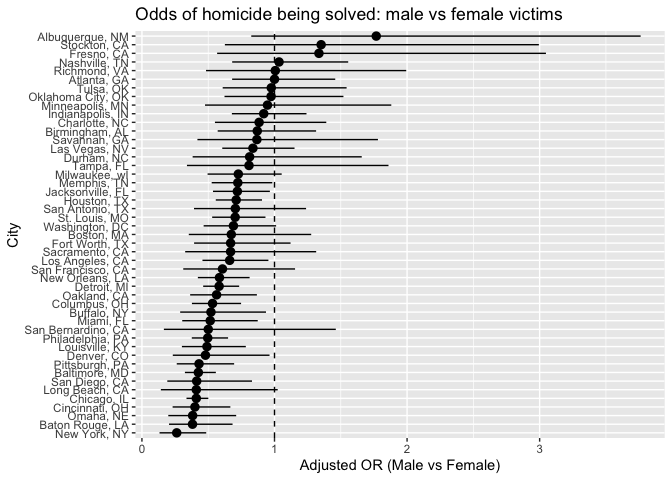
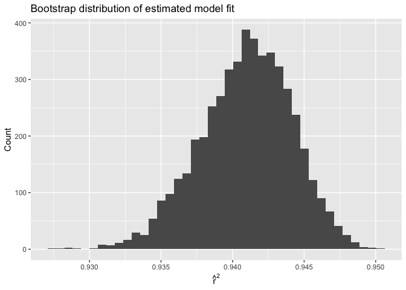
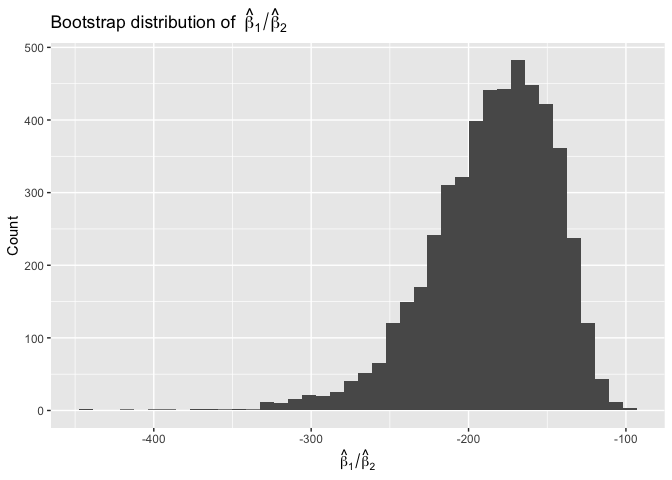

p8105_hw6_xz3312
================
Eric Zhang
2025-12-01

# Problem 1

The Washington Post has gathered data on homicides in 50 large U.S.
cities and made the data available through a GitHub repository

``` r
# load data from GitHub

homicides_data <- read_csv(
  "https://raw.githubusercontent.com/washingtonpost/data-homicides/master/homicide-data.csv"
)
```

    ## Rows: 52179 Columns: 12
    ## ── Column specification ────────────────────────────────────────────────────────
    ## Delimiter: ","
    ## chr (9): uid, victim_last, victim_first, victim_race, victim_age, victim_sex...
    ## dbl (3): reported_date, lat, lon
    ## 
    ## ℹ Use `spec()` to retrieve the full column specification for this data.
    ## ℹ Specify the column types or set `show_col_types = FALSE` to quiet this message.

### Part a

Create a city_state variable (e.g. “Baltimore, MD”), and a binary
variable indicating whether the homicide is solved. Omit cities Dallas,
TX; Phoenix, AZ; and Kansas City, MO – these don’t report victim race.
Also omit Tulsa, AL – this is a data entry mistake. For this problem,
limit your analysis those for whom victim_race is white or black. Be
sure that victim_age is numeric.

``` r
homicides_clean <- homicides_data %>% 
  mutate(
    city_state  = str_c(city, state, sep = ", "),
    resolved    = if_else(disposition == "Closed by arrest", 1, 0),

    # fix victim_age before numeric conversion
    victim_age  = na_if(victim_age, "Unknown"),
    victim_age  = as.numeric(victim_age),

    # convert sex and race to factors
    victim_sex  = factor(victim_sex),
    victim_race = factor(victim_race),

    # ensure female is the reference level
    victim_sex  = fct_relevel(victim_sex, "Female")
  ) %>% 
  filter(
    !city_state %in% c("Dallas, TX", "Phoenix, AZ", "Kansas City, MO", "Tulsa, AL"),
    victim_race %in% c("White", "Black")
  ) %>% 
  drop_na(resolved, victim_age, victim_sex, victim_race)
```

### Part b

For the city of Baltimore, MD, use the glm function to fit a logistic
regression with resolved vs unresolved as the outcome and victim age,
sex and race as predictors. Save the output of glm as an R object; apply
the broom::tidy to this object; and obtain the estimate and confidence
interval of the adjusted odds ratio for solving homicides comparing male
victims to female victims keeping all other variables fixed.

``` r
baltimore <- homicides_clean %>% 
  filter(city_state == "Baltimore, MD")

fit_baltimore <- glm(
  resolved ~ victim_age + victim_sex + victim_race,
  data = baltimore,
  family = binomial()
)

baltimore_or <- fit_baltimore %>% 
  broom::tidy(conf.int = TRUE, exponentiate = TRUE) %>% 
  filter(term == "victim_sexMale") %>% 
  select(term, estimate, conf.low, conf.high)

baltimore_or
```

    ## # A tibble: 1 × 4
    ##   term           estimate conf.low conf.high
    ##   <chr>             <dbl>    <dbl>     <dbl>
    ## 1 victim_sexMale    0.426    0.324     0.558

Using the fitted logistic regression model for Baltimore, MD, the
adjusted odds ratio for solving a homicide for male victims compared to
female victims, holding age and race constant, is 0.43, with a 95%
confidence interval (0.32, 0.56).

Since this odds ratio is below 1, the model suggests that homicides
involving male victims are less likely to be solved than those involving
female victims, after adjusting for age and race.

### Part c

Now run glm for each of the cities in your dataset, and extract the
adjusted odds ratio (and CI) for solving homicides comparing male
victims to female victims. Do this within a “tidy” pipeline, making use
of purrr::map, list columns, and unnest as necessary to create a
dataframe with estimated ORs and CIs for each city.

``` r
city_ors <- homicides_clean %>% 
  nest(data = -city_state) %>% 
  mutate(
    fit = map(
      data,
      ~ glm(
        resolved ~ victim_age + victim_sex + victim_race,
        data   = .x,
        family = binomial()
      )
    ),
    tidy = map(
      fit,
      ~ tidy(.x, conf.int = TRUE, exponentiate = TRUE)
    )
  ) %>% 
  select(city_state, tidy) %>% 
  unnest(tidy) %>% 
  filter(term == "victim_sexMale") %>% 
  select(city_state, estimate, conf.low, conf.high)
```

    ## Warning: There were 43 warnings in `mutate()`.
    ## The first warning was:
    ## ℹ In argument: `tidy = map(fit, ~tidy(.x, conf.int = TRUE, exponentiate =
    ##   TRUE))`.
    ## Caused by warning:
    ## ! glm.fit: fitted probabilities numerically 0 or 1 occurred
    ## ℹ Run `dplyr::last_dplyr_warnings()` to see the 42 remaining warnings.

``` r
city_ors
```

    ## # A tibble: 47 × 4
    ##    city_state      estimate conf.low conf.high
    ##    <chr>              <dbl>    <dbl>     <dbl>
    ##  1 Albuquerque, NM    1.77     0.825     3.76 
    ##  2 Atlanta, GA        1.00     0.680     1.46 
    ##  3 Baltimore, MD      0.426    0.324     0.558
    ##  4 Baton Rouge, LA    0.381    0.204     0.684
    ##  5 Birmingham, AL     0.870    0.571     1.31 
    ##  6 Boston, MA         0.674    0.353     1.28 
    ##  7 Buffalo, NY        0.521    0.288     0.936
    ##  8 Charlotte, NC      0.884    0.551     1.39 
    ##  9 Chicago, IL        0.410    0.336     0.501
    ## 10 Cincinnati, OH     0.400    0.231     0.667
    ## # ℹ 37 more rows

Across cities, the adjusted odds ratios comparing male to female victims
vary substantially. For example, Albuquerque has an OR of 1.77 with a
95% CI of (0.82, 3.76), indicating higher odds of a homicide being
solved for male victims. In contrast, Baltimore shows a much lower OR of
0.43 (95% CI: 0.32, 0.56), suggesting male-victim homicides are less
likely to be solved than female-victim homicides.

Many cities, such as Boston (0.67), have odds ratios below 1, while
others, such as Atlanta (1), are close to 1, indicating little
difference by victim sex. Overall, most confidence intervals include
values below 1, suggesting that in many cities male-victim homicides
tend to be solved at lower rates.

### Part d

Create a plot that shows the estimated ORs and CIs for each city.
Organize cities according to estimated OR, and comment on the plot.

``` r
city_ors %>% 
  ggplot(aes(
    x = reorder(city_state, estimate),
    y = estimate,
    ymin = conf.low,
    ymax = conf.high
  )) +
  geom_pointrange() +
  geom_hline(yintercept = 1, linetype = "dashed") +
  coord_flip() +
  labs(
    x = "City",
    y = "Adjusted OR (Male vs Female)",
    title = "Odds of homicide being solved: male vs female victims"
  )
```

<!-- --> The
plot shows a lot of variation across cities in the odds of solving
homicides for male versus female victims. Most cities have odds ratios
below 1, suggesting that homicides involving male victims are generally
less likely to be solved. Only a few cities have odds ratios above 1,
and many confidence intervals are wide, indicating uncertainty in
estimates of several cities.

# Problem 2

For this problem, we’ll use the Central Park weather data.

### Part a

The code chunk below will import these data from the p8105.datasets
package.We’ll focus on a simple linear regression with tmax as the
response with tmin and prcp as the predictors, and are interested in the
distribution of two quantities estimated from these data:

r_hat_square beta_hat_1 / beta_hat_2

Use 5000 bootstrap samples and, for each bootstrap sample, produce
estimates of these two quantities.

``` r
set.seed(123)

boot_results <- weather_df %>% 
  drop_na(tmax, tmin, prcp) %>% 
  modelr::bootstrap(5000) %>% 
  mutate(
    # fit tmax ~ tmin + prcp in each bootstrap sample
    model  = map(strap, ~ lm(tmax ~ tmin + prcp, data = .x)),
    gl     = map(model, broom::glance),
    td     = map(model, broom::tidy),
    r_hat_sq = map_dbl(gl, "r.squared"),
    beta_ratio = map_dbl(
      td,
      ~ {
        b1 <- .x$estimate[.x$term == "tmin"]
        b2 <- .x$estimate[.x$term == "prcp"]
        b1 / b2
      }
    )
  ) %>% 
  select(r_hat_sq, beta_ratio)

head(boot_results)
```

    ## # A tibble: 6 × 2
    ##   r_hat_sq beta_ratio
    ##      <dbl>      <dbl>
    ## 1    0.936      -158.
    ## 2    0.939      -217.
    ## 3    0.943      -159.
    ## 4    0.946      -196.
    ## 5    0.941      -142.
    ## 6    0.941      -142.

### Part b

Plot the distribution of your estimates, and describe these in words.
Using the 5000 bootstrap estimates, identify the 2.5% and 97.5%
quantiles to provide a 95% confidence interval for r_hat_square and
beta_1_hat / beta_2_hat

``` r
# Distribution of R^2 hat
boot_results %>% 
  ggplot(aes(x = r_hat_sq)) +
  geom_histogram(bins = 40) +
  labs(
    title = "Bootstrap distribution of estimated model fit",
    x = expression(hat(r)^2),
    y = "Count"
  )
```

<!-- -->

``` r
boot_results %>% 
  ggplot(aes(x = beta_ratio)) +
  geom_histogram(bins = 40) +
  labs(
    title = bquote("Bootstrap distribution of " ~ hat(beta)[1] / hat(beta)[2]),
    x = expression(hat(beta)[1] / hat(beta)[2]),
    y = "Count"
  )
```

<!-- --> The
bootstrap distribution of r^2 is tight, symmetric, and centered around
~0.94, indicating high stability in model fit across samples. The
bootstrap distribution of β̂1 / β̂2 is wide, right-skewed, and very
negative, showing that the ratio is unstable because β̂2 is small and
close to zero.

``` r
# 95% Confidence intervals
r2_ci <- quantile(boot_results$r_hat_sq, probs = c(0.025, 0.975))
beta_ratio_ci <- quantile(boot_results$beta_ratio, probs = c(0.025, 0.975))

r2_ci
```

    ##      2.5%     97.5% 
    ## 0.9343890 0.9466496

``` r
beta_ratio_ci
```

    ##      2.5%     97.5% 
    ## -277.1703 -125.7063

r^2 is very stable across bootstraps (CI ≈ 0.934–0.947). β̂1 / β̂2 is
large, negative, and unstable (CI ≈ -277 to -126) due to a small β̂2.

# Problem 3

In this problem, you will analyze data gathered to understand the
effects of several variables on a child’s birthweight. This dataset
consists of roughly 4000 children and includes the following variables:
babysex: baby’s sex (male = 1, female = 2) bhead: baby’s head
circumference at birth (centimeters) blength: baby’s length at birth
(centimeters) bwt: baby’s birth weight (grams) delwt: mother’s weight at
delivery (pounds) fincome: family monthly income (in hundreds, rounded)
frace: father’s race (1 = White, 2 = Black, 3 = Asian, 4 = Puerto Rican,
8 = Other, 9 = Unknown) gaweeks: gestational age in weeks malform:
presence of malformations that could affect weight (0 = absent, 1 =
present) menarche: mother’s age at menarche (years) mheigth: mother’s
height (inches) momage: mother’s age at delivery (years) mrace: mother’s
race (1 = White, 2 = Black, 3 = Asian, 4 = Puerto Rican, 8 = Other)
parity: number of live births prior to this pregnancy pnumlbw: previous
number of low birth weight babies pnumgsa: number of prior small for
gestational age babies ppbmi: mother’s pre-pregnancy BMI ppwt: mother’s
pre-pregnancy weight (pounds) smoken: average number of cigarettes
smoked per day during pregnancy wtgain: mother’s weight gain during
pregnancy (pounds)

### Part a

Load and clean the data for regression analysis (i.e. use appropriate
variable names, convert numeric to factor where appropriate, check for
the presence of missing data, etc.).

``` r
# load the data
birthweight <- read_csv("birthweight.csv") %>% 
  mutate(
    babysex = factor(babysex, labels = c("Male", "Female")),
    frace   = factor(frace),
    mrace   = factor(mrace),
    malform = factor(malform),
  )
```

    ## Rows: 4342 Columns: 20
    ## ── Column specification ────────────────────────────────────────────────────────
    ## Delimiter: ","
    ## dbl (20): babysex, bhead, blength, bwt, delwt, fincome, frace, gaweeks, malf...
    ## 
    ## ℹ Use `spec()` to retrieve the full column specification for this data.
    ## ℹ Specify the column types or set `show_col_types = FALSE` to quiet this message.

``` r
summary(birthweight)
```

    ##    babysex         bhead          blength           bwt           delwt      
    ##  Male  :2230   Min.   :21.00   Min.   :20.00   Min.   : 595   Min.   : 86.0  
    ##  Female:2112   1st Qu.:33.00   1st Qu.:48.00   1st Qu.:2807   1st Qu.:131.0  
    ##                Median :34.00   Median :50.00   Median :3132   Median :143.0  
    ##                Mean   :33.65   Mean   :49.75   Mean   :3114   Mean   :145.6  
    ##                3rd Qu.:35.00   3rd Qu.:51.00   3rd Qu.:3459   3rd Qu.:157.0  
    ##                Max.   :41.00   Max.   :63.00   Max.   :4791   Max.   :334.0  
    ##     fincome      frace       gaweeks      malform     menarche    
    ##  Min.   : 0.00   1:2123   Min.   :17.70   0:4327   Min.   : 0.00  
    ##  1st Qu.:25.00   2:1911   1st Qu.:38.30   1:  15   1st Qu.:12.00  
    ##  Median :35.00   3:  46   Median :39.90            Median :12.00  
    ##  Mean   :44.11   4: 248   Mean   :39.43            Mean   :12.51  
    ##  3rd Qu.:65.00   8:  14   3rd Qu.:41.10            3rd Qu.:13.00  
    ##  Max.   :96.00            Max.   :51.30            Max.   :19.00  
    ##     mheight          momage     mrace        parity            pnumlbw 
    ##  Min.   :48.00   Min.   :12.0   1:2147   Min.   :0.000000   Min.   :0  
    ##  1st Qu.:62.00   1st Qu.:18.0   2:1909   1st Qu.:0.000000   1st Qu.:0  
    ##  Median :63.00   Median :20.0   3:  43   Median :0.000000   Median :0  
    ##  Mean   :63.49   Mean   :20.3   4: 243   Mean   :0.002303   Mean   :0  
    ##  3rd Qu.:65.00   3rd Qu.:22.0            3rd Qu.:0.000000   3rd Qu.:0  
    ##  Max.   :77.00   Max.   :44.0            Max.   :6.000000   Max.   :0  
    ##     pnumsga      ppbmi            ppwt           smoken           wtgain      
    ##  Min.   :0   Min.   :13.07   Min.   : 70.0   Min.   : 0.000   Min.   :-46.00  
    ##  1st Qu.:0   1st Qu.:19.53   1st Qu.:110.0   1st Qu.: 0.000   1st Qu.: 15.00  
    ##  Median :0   Median :21.03   Median :120.0   Median : 0.000   Median : 22.00  
    ##  Mean   :0   Mean   :21.57   Mean   :123.5   Mean   : 4.145   Mean   : 22.08  
    ##  3rd Qu.:0   3rd Qu.:22.91   3rd Qu.:134.0   3rd Qu.: 5.000   3rd Qu.: 28.00  
    ##  Max.   :0   Max.   :46.10   Max.   :287.0   Max.   :60.000   Max.   : 89.00

### Part b

Propose a regression model for birthweight. This model may be based on a
hypothesized structure for the factors that underly birthweight, on a
data-driven model-building process, or a combination of the two.
Describe your modeling process and show a plot of model residuals
against fitted values – use add_predictions and add_residuals in making
this plot.

For my primary birthweight model, I select the following predictors:

bwt ∼ blength + bhead + gaweeks + ppbmi + momage + wtgain + smoken

Mpdeling process: I modeled birthweight (`bwt`) using a multiple linear
regression that focuses on key predictors of fetal growth. My proposed
model includes infant length (`blength`), head circumference (`bhead`),
gestational age (`gaweeks`), and maternal factors such as pre-pregnancy
BMI (`ppbmi`), maternal age (`momage`), pregnancy weight gain
(`wtgain`), and smoking (`smoken`). These variables represent both
newborn size and prenatal conditions known to influence birthweight. I
excluded other highly collinear or postnatal measurements to keep the
model interpretable and biologically reasonable.

``` r
mod_main <- lm(
  bwt ~ blength + bhead + gaweeks + ppbmi + momage + wtgain + smoken,
  data = birthweight
)

tidy(mod_main)
```

    ## # A tibble: 8 × 5
    ##   term        estimate std.error statistic   p.value
    ##   <chr>          <dbl>     <dbl>     <dbl>     <dbl>
    ## 1 (Intercept) -6191.      98.2      -63.1  0        
    ## 2 blength        79.2      2.06      38.4  1.23e-277
    ## 3 bhead         134.       3.50      38.4  2.41e-277
    ## 4 gaweeks        13.3      1.50       8.86 1.16e- 18
    ## 5 ppbmi           4.67     1.36       3.42 6.21e-  4
    ## 6 momage          7.22     1.13       6.41 1.61e- 10
    ## 7 wtgain          4.01     0.407      9.86 1.07e- 22
    ## 8 smoken         -2.40     0.582     -4.12 3.89e-  5

``` r
glance(mod_main)
```

    ## # A tibble: 1 × 12
    ##   r.squared adj.r.squared sigma statistic p.value    df  logLik    AIC    BIC
    ##       <dbl>         <dbl> <dbl>     <dbl>   <dbl> <dbl>   <dbl>  <dbl>  <dbl>
    ## 1     0.698         0.698  282.     1431.       0     7 -30649. 61316. 61374.
    ## # ℹ 3 more variables: deviance <dbl>, df.residual <int>, nobs <int>

The model explains variability in birthweight, with an $R^2$ of 0.698
and a residual standard error of about 281.7 grams. Key predictors show
strong positive associations: each additional centimeter of baby length
adds 79.2 grams, and each additional centimeter of head circumference
adds 134.2 grams. Gestational age also increases birthweight by 13.3
grams per week. Maternal BMI and pregnancy weight gain contribute modest
increases, while smoking is associated with a decrease of -2.4 grams per
cigarette per day.

``` r
# Residual vs fitted plot
birthweight_main <- birthweight %>% 
  add_predictions(mod_main) %>% 
  add_residuals(mod_main)

birthweight_main %>% 
  ggplot(aes(x = pred, y = resid)) +
  geom_point(alpha = 0.3) +
  geom_hline(yintercept = 0, linetype = "dashed") +
  labs(
    title = "Residuals vs Fitted Values: Main Birthweight Model",
    x = "Fitted birthweight (grams)",
    y = "Residuals"
  )
```

<!-- -->
Residuals appear roughly centered around zero across the range of fitted
values with no strong patterns, suggesting that linearity and
homoscedasticity are satisfied. A few large residuals are seen, but
overall the model fit looks good.

### Part c

Compare your model to two others: A) One using length at birth and
gestational age as predictors (main effects only) B) One using head
circumference, length, sex, and all interactions (including the
three-way interaction) between these Make this comparison in terms of
the cross-validated prediction error; use crossv_mc and functions in
purrr as appropriate.

``` r
# Two comparison models (required by assignment)**

# *Model A: Uses only baby length and gestational age (main effects)
mod_simple <- lm(
  bwt ~ blength + gaweeks,
  data = birthweight
)

# *Model B: Head circumference, length, baby sex, and all interactions (including 3-way interaction)
mod_inter <- lm(
  bwt ~ bhead * blength * babysex,
  data = birthweight
)

set.seed(1)

cv_df <- crossv_mc(birthweight, n = 100)

cv_results <- cv_df %>% 
  mutate(
    train = map(train, as_tibble),
    test  = map(test, as_tibble),

    fit_main = map(train, ~ lm(
      bwt ~ blength + bhead + gaweeks + ppbmi + momage + wtgain + smoken,
      data = .x
    )),
    fit_simple = map(train, ~ lm(
      bwt ~ blength + gaweeks,
      data = .x
    )),
    fit_inter = map(train, ~ lm(
      bwt ~ bhead * blength * babysex,
      data = .x
    )),

    rmse_main   = map2_dbl(fit_main,   test, ~ rmse(.x, .y)),
    rmse_simple = map2_dbl(fit_simple, test, ~ rmse(.x, .y)),
    rmse_inter  = map2_dbl(fit_inter,  test, ~ rmse(.x, .y))
  )

cv_summary <- cv_results %>% 
  summarise(
    rmse_main   = mean(rmse_main),
    rmse_simple = mean(rmse_simple),
    rmse_inter  = mean(rmse_inter)
  )

cv_long <- cv_results %>% 
  select(rmse_main, rmse_simple, rmse_inter) %>% 
  pivot_longer(
    cols = everything(),
    names_to = "model",
    values_to = "rmse"
  ) %>% 
  mutate(
    model = recode(
      model,
      rmse_main   = "Proposed birthweight model",
      rmse_simple = "Length + gestational age",
      rmse_inter  = "Head circumference × length × sex"
    ),
    model = factor(
      model,
      levels = c(
        "Head circumference × length × sex",
        "Length + gestational age",
        "Proposed birthweight model"
      )
    )
  )

cv_long %>% 
  ggplot(aes(x = model, y = rmse)) +
  geom_violin(trim = FALSE) +
  geom_boxplot(width = 0.15) +
  labs(
    title = "Cross-validated RMSE of birthweight models",
    x = NULL,
    y = "RMSE"
  ) +
  theme_minimal()
```

<!-- -->

``` r
cv_summary
```

    ## # A tibble: 1 × 3
    ##   rmse_main rmse_simple rmse_inter
    ##       <dbl>       <dbl>      <dbl>
    ## 1      282.        332.       289.

Based on the cross-validated RMSE values, the proposed model performs
best with an average RMSE of 281.9, lower than both the simpler
length–gestational age model (332.2) and the interaction-heavy model
(288.6). This indicates that the proposed model achieves the strongest
predictive accuracy without unnecessary complexity.

The violin plot reflects this result. Shows that the
`Proposed birthweight model` (including `blength`, `bhead`, `gaweeks`,
`ppbmi`, `momage`, `wtgain`, and `smoken`) performing slightly better
than interaction model and clearly better than the simple
`Length + gestational age` model, whose RMSE distribution is highest and
most variable.
